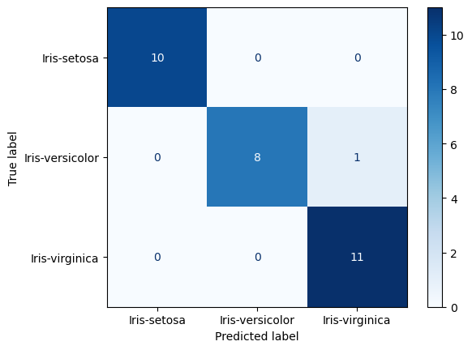
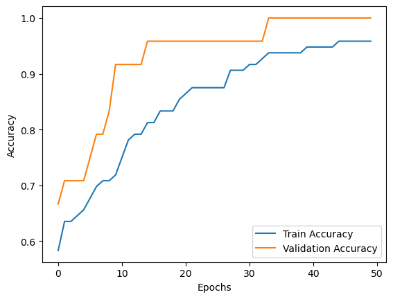
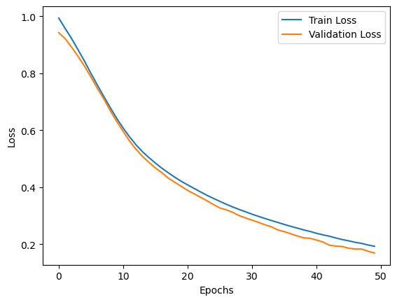

# 🌸 Iris Flower Classification using ANN

This project implements an **Artificial Neural Network (ANN)** to classify Iris flowers into three species:
- Iris-setosa
- Iris-versicolor
- Iris-virginica  

The model is trained on the famous [Iris dataset](https://archive.ics.uci.edu/ml/datasets/iris), achieving **96.67% accuracy** on the test set.

---

## 📂 Project Structure
├── artifacts/
│   └── iris_ann.h5              # Saved trained ANN model
│
├── data/
│   ├── database.sqlite           # Example SQLite database (optional usage)
│   └── Iris.csv                  # Dataset (150 samples, 4 features, 3 classes)
│
├── images/
│   ├── confusion_matrix.png      # Confusion matrix
│   ├── accuracy_plot.png         # Training vs Validation Accuracy
│   └── loss_plot.png             # Training vs Validation Loss
│
├── src/
│   ├── eda.ipynb                 # Exploratory Data Analysis
│   ├── encode+scale.ipynb        # Encoding + Feature Scaling
│   ├── preprocess.ipynb          # Full preprocessing pipeline
│   └── train.ipynb               # ANN training and evaluation
│
└── README.md                     # Project documentation

---

## ⚙️ Workflow
1. **EDA (eda.ipynb)**  
   - Basic dataset inspection, distributions, class balance.  

2. **Encoding & Scaling (encode+scale.ipynb)**  
   - One-hot encode `Species`.  
   - Standardize features using `StandardScaler`.  

3. **Preprocessing (preprocess.ipynb)**  
   - Split into train/test sets.  
   - Apply scaling (fit on train, transform test).  

4. **Model Training (train.ipynb)**  
   - ANN with 2 hidden layers (ReLU activation).  
   - Optimizer: Adam  
   - Loss: Categorical Crossentropy  
   - Epochs: 50, Batch size: 8  
   - Saved model → `artifacts/iris_ann.h5`  

---

## 📊 Results
- **Test Accuracy:** 96.67%  

### Confusion Matrix


### Training vs Validation Accuracy


### Training vs Validation Loss


---

## 🚀 How to Run
1. Clone the repository:
```bash
git clone https://github.com/Gokul-bit165/Iris-ann.git
cd iris-ann
```

## Install dependencies
```bash
pip install pandas scikit-learn tensorflow matplotlib
```
## Run the script
```bash
python iris_ann.py

```
## 📌 Future Improvements

Add Dropout for regularization

Tune hyperparameters (layers, neurons, learning rate)

Visualize decision boundaries

Deploy using Flask/FastAPI or Streamlit

## 🙌 Credits

Dataset: Fisher’s Iris Dataset (UCI Machine Learning Repository)

Frameworks: TensorFlow
, Scikit-learn